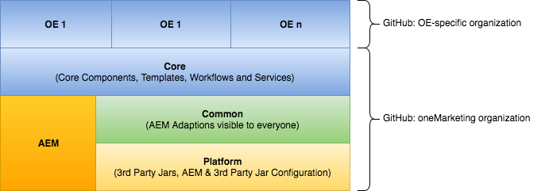
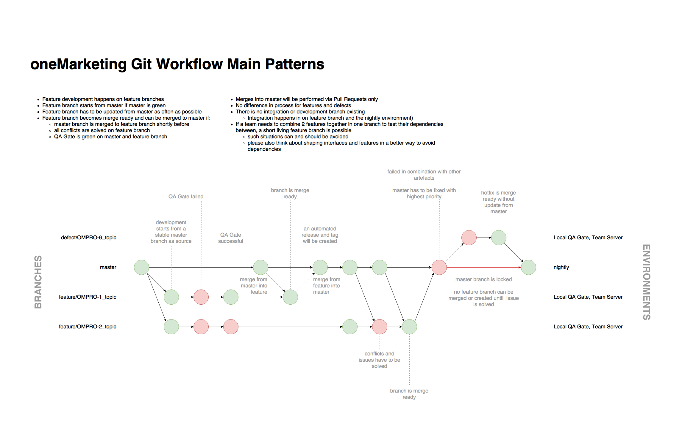
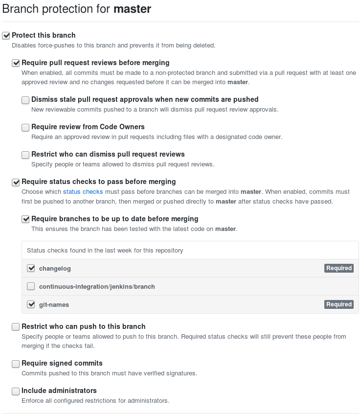
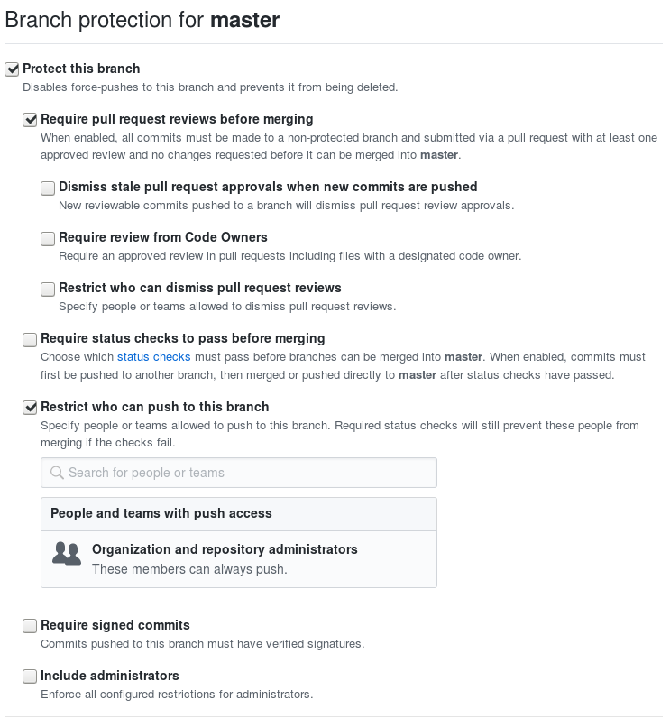

<!-- START doctoc generated TOC please keep comment here to allow auto update -->
<!-- DON'T EDIT THIS SECTION, INSTEAD RE-RUN doctoc TO UPDATE -->
**Table of Contents**  *generated with [DocToc](https://github.com/thlorenz/doctoc)*

- [Introduction](#introduction)
- [Multi-Tenancy](#multi-tenancy)
  - [JCR Structure](#jcr-structure)
    - [Content](#content)
    - [Apps](#apps)
    - [OSGi configurations](#osgi-configurations)
    - [/conf Configurations](#conf-configurations)
    - [Oak Index Configurations](#oak-index-configurations)
    - [Sling Context-Aware Configuration](#sling-context-aware-configuration)
    - [Sling Servlets](#sling-servlets)
    - [Blueprints](#blueprints)
    - [Designs](#designs)
    - [Personalization](#personalization)
    - [Workflows](#workflows)
    - [Users & Groups](#users--groups)
    - [Service Users](#service-users)
    - [Tags](#tags)
    - [Temporary Data](#temporary-data)
  - [Java Namespaces](#java-namespaces)
  - [Maven package structure](#maven-package-structure)
  - [Namespacing for CSS / JavaScript](#namespacing-for-css--javascript)
- [General Development Guidelines](#general-development-guidelines)
  - [Inheriting from other Components](#inheriting-from-other-components)
  - [AEM Frontend Components](#aem-frontend-components)
  - [AEM Backend Components](#aem-backend-components)
  - [AEM Service User in oneMarketing](#aem-service-user-in-onemarketing)
  - [Git Workflow](#git-workflow)
  - [Quality Gate](#quality-gate)
  - [CleanCode](#cleancode)
- [Code Formatting](#code-formatting)
- [Development Process](#development-process)
  - [Local Development Environments (unsupported)](#local-development-environments-unsupported)
  - [Git Project Structure](#git-project-structure)
  - [Git Configuration](#git-configuration)
  - [Git Workflow](#git-workflow-1)
  - [Branch Name Policy](#branch-name-policy)
  - [Commit Message Policy](#commit-message-policy)
  - [Client-side Git Hooks](#client-side-git-hooks)
  - [GitHub Commit Status](#github-commit-status)
  - [GitHub Enterprise Branch Protection Settings](#github-enterprise-branch-protection-settings)
    - [Artifact Specific Settings](#artifact-specific-settings)
    - [Product / Continuous Delivery Jenkins Configuration Specific Settings](#product--continuous-delivery-jenkins-configuration-specific-settings)
  - [Changelogs](#changelogs)
  - [Summary](#summary)
- [Build Process](#build-process)
  - [Summary](#summary-1)
  - [Jenkins Pipeline](#jenkins-pipeline)
    - [How to Build Your Code](#how-to-build-your-code)
    - [How to Update Legacy Branches](#how-to-update-legacy-branches)
- [Code Review](#code-review)
- [Logging](#logging)
- [Pattern](#pattern)
  - [Component Overlaying](#component-overlaying)
  - [Model View Controller](#model-view-controller)
    - [Model](#model)
    - [View](#view)
    - [Controller](#controller)
- [Java Development Kit](#java-development-kit)
- [Maven](#maven)
  - [Maven Bundle Plugin](#maven-bundle-plugin)
- [AEM Backend Development (currently only allowed for the oneMarketing Platform Team)](#aem-backend-development-currently-only-allowed-for-the-onemarketing-platform-team)
  - [Replication](#replication)
  - [Runmodes](#runmodes)
  - [Access Control List](#access-control-list)
  - [Apache Jackrabbit Oak](#apache-jackrabbit-oak)
  - [Apache Jackrabbit Oak Indexes](#apache-jackrabbit-oak-indexes)
  - [Components](#components)
  - [JCR Event Listener](#jcr-event-listener)
  - [JCR Session Usage](#jcr-session-usage)
  - [OSGi](#osgi)
  - [OSGi Configurations](#osgi-configurations)
  - [JCR Reading & Writing](#jcr-reading--writing)
  - [Writing JCR Data](#writing-jcr-data)
  - [Scheduled Tasks](#scheduled-tasks)
  - [Sling EventHandler](#sling-eventhandler)
  - [SlingFilter](#slingfilter)
  - [SlingJobs](#slingjobs)
  - [SlingModels](#slingmodels)
  - [SlingServlets](#slingservlets)
  - [Sling Context-Aware Configuration](#sling-context-aware-configuration-1)
    - [Naming convention](#naming-convention)
  - [Vault](#vault)
  - [Workflows](#workflows-1)
    - [Launcher](#launcher)
    - [Model](#model-1)
    - [Scripts](#scripts)
  - [Temporary Data](#temporary-data-1)
  - [ACS Commons](#acs-commons)
  - [ACS Tools](#acs-tools)
  - [AEM Core Components](#aem-core-components)
  - [i18n](#i18n)
  - [Component Guidelines](#component-guidelines)
    - [Adaption](#adaption)
    - [Component Composition](#component-composition)
      - [Atom Composition](#atom-composition)
      - [Molecule Composition](#molecule-composition)
      - [Default Values](#default-values)
    - [Inheritance](#inheritance)
    - [Javascript Component's Life Cycle](#javascript-components-life-cycle)
      - [Mode](#mode)
      - [Action](#action)
  - [Sonar Rules](#sonar-rules)
- [AEM Frontend Development](#aem-frontend-development)
  - [Integration of CSS to AEM](#integration-of-css-to-aem)
  - [Integration of JavaScript to AEM](#integration-of-javascript-to-aem)
  - [SourceMaps](#sourcemaps)
  - [Styleguide Integration](#styleguide-integration)
- [Dispatcher Development](#dispatcher-development)
  - [Handling of Query Parameter](#handling-of-query-parameter)
- [How to build a component](#how-to-build-a-component)
  - [CQ Dialog](#cq-dialog)
  - [Dialog](#dialog)
  - [Image Handling / Named Transformed Image](#image-handling--named-transformed-image)
  - [Sightly](#sightly)
  - [SlingModels](#slingmodels-1)
  - [Touch UI](#touch-ui)
  - [JSP](#jsp)
  - [Clientlibs](#clientlibs)
    - [Clientlib Category](#clientlib-category)
    - [CSS](#css)
- [Tutorials](#tutorials)
- [Notes](#notes)

<!-- END doctoc generated TOC please keep comment here to allow auto update -->


## Introduction

This documentation contains all necessary information which are needed to develop AEM projects for Allianz.

All guidelines are measurable, have to be followed and are enforced strictly.

## Multi-Tenancy

oneMarketing provides a shared AEM platform, where multiple websites of multiple tenants are running on the same platform. In such an environment it is necessary to provide mechanisms to ensure that the tenants are not influencing each other. The multi tenant capability will be achieved by separating all deployed artifacts (code and content) by use of appropriate namespaces.

The namespaces contains of two dimensions. The first dimension is the tenant itself (**`<tenant>`**). The second dimension is a module or a website of the tenant (**`<module | site>`**). This two dimensions will be used in the naming of all artifacts (JCR structure, Java packages, Maven modules, etc.):
- `<tenant>` for oneMarketing Project Team (Allianz Technology) is **platform**
- `<tenant>` for OEs will be provided by oneMarketing. The list is maintained in [https://github.developer.allianz.io/oneMarketing/oe-projects/blob/master/oe_identifiers.yml](https://github.developer.allianz.io/oneMarketing/oe-projects/blob/master/oe_identifiers.yml).

For large OEs with several websites it is recommended to add a virtual `<site>` named **common** to store artifacts which are used on multiple websites.

> :information_source: Be resource friendly: This Multi Tenant Concept provides a namespace separation level. At this level of separation there is no Resource or CPU capping and throttling available. Please be polite to all other shared!

### JCR Structure

#### Content

**_Platform:_**

 ```
/content/onemarketing/<tenant>/<site>/<language>
/content/experience-fragments/onemarketing/<tenant>/<site>/<language>
/content/dam/onemarketing/<tenant>/<site>/<language>
/content/campaigns/onemarketing/<tenant>/<site>
 ```

**_OE-specific:_**

 see Platform

#### Apps
**_Platform:_**
```
/apps/onemarketing/<tenant>/<module>/<archetype-structure>
/apps/onemarketing/<tenant>/<module>/install
```

**_OE-specific:_**
```
/apps/onemarketing/<tenant>/<site>/<archetype-structure>
/apps/onemarketing/<tenant>/<site>/install
```

#### OSGi configurations
**_Platform:_**

```
/apps/onemarketing/platform/config[.<runmode>]
/apps/onemarketing/platform/<module>/config[.<runmode>]
```
OSGI configurations can be provided runmode specific. To achieve this add the runmodes as part of the `config` folder separated with a dot character(e.g. `config.prod.author`). The available runmodes which are maintained for oneMarketing AEM environments are defined in [AEM Runmodes](https://wiki.onewebuxp.allianz/confluence/x/T8IGAg). For additional information refer to the Runmodes section in this document.

**_OE-specific:_**
```
/apps/onemarketing/<tenant>/config[.<runmode>]
/apps/onemarketing/<tenant>/<module|site>/config[.<runmode>]
```

:warning: Only for OE own OSGi Services; Name of persistend identity (i.e. filename of configuration) must match the full qualified Java Package name of the OSGi Service like described in Java Namespaces.

#### /conf Configurations
**_Platform:_**
```

/conf/onemarketing/platform/<module|site>
/conf/onemarketing/platform-default/<module|site>
/conf/global (hardcoded default fallback)
/conf/global/settings/dam/adminui-extension/metadataschema/onemarketing-platform
```

**_OE-specific:_**
```
/conf/onemarketing/<tenant>/<module|site>
/conf/onemarketing/<tenant>-default/<module|site>
/conf/global/settings/dam/adminui-extension/metadataschema/onemarketing-<tenant>
```

#### Oak Index Configurations
**_Platform:_**

oak:index location:
```
/apps/onemarketing/platform/oak-index/onemarketing_platform_<identifier>
```

**_OE-specific:_**

oak:index location:
```
/apps/onemarketing/<tenant>/[<module|site>]/oak-index/onemarketing_<tenant>_<identifier>
```

The Ensure Oak Index configuration has to be located as described in chapter [OSGi configurations](#osgi-configurations).

Details about the configuration of oak:indexes are described in the chapter [Apache Jackrabbit Oak Indexes](#apache-jackrabbit-oak-indexes)

#### Sling Context-Aware Configuration
**_Platform:_**

```
/* Label: Platform - <short description> */

/* Name */
onemarketing/platform/<config>
onemarketing/platform/<module>/<config>
```

**_OE-specific:_**
```
/* Label: <Tenant short display name> - <short description> */

/* Name */
onemarketing/<tenant>/<config>
onemarketing/<tenant>/<module|site>/<config>
```

#### Rewriter pipelines
**_Platform:_**
```
/apps/onemarketing-platform/config/rewriter
```

**_OE-specific:_**
```
/apps/onemarketing-<tenant>/config/rewriter
```

#### Sling Servlets
Only Sling Servlets with resource binding are allowed. The resource type binding has to be provided using annotations.
Each resource type has to follow the pattern `[/apps/]onemarketing/<tenant>/...`.

**_Platform:_**

```
@Component(service = Servlet.class, property = {
    "sling.servlet.resourceTypes=onemarketing/<tenant>/sth",
    "sling.servlet.methods=GET"})
public class MyServlet extends SlingSafeMethodsServlet {
```

**_OE-specific:_**

see Platform

#### Blueprints

Blueprints of sites that can be managed and applied with the Multi Site Manager.

**_Platform:_**
```
/etc/blueprints/onemarketing/<tenant>
```

**_OE-specific:_**
```
/etc/blueprints/onemarketing/<tenant>/<site>
```

#### Designs

Consists of CSS & JavaScript and the definition of allowed usages of the components.

**_Platform:_**
```
/etc/clientlibs/onemarketing/<tenant> # contains the CSS & JavaScript
/etc/designs/onemarketing/<tenant>    # contains the definition of the allowed usage
```

**_OE-specific:_**
```
/etc/clientlibs/onemarketing/<tenant>/<site>  # contains the CSS & JavaScript
/etc/designs/onemarketing/<tenant>/<site>     # contains the definition of the allowed usage
```

#### Personalization

**_Platform:_**
```
/etc/clientcontext/onemarketing/<tenant>/contextstores
/etc/segmentation/onemarketing/<tenant>
```

**_OE-specific:_**
```
/etc/clientcontext/onemarketing/<tenant>/<site>/contextstores
/etc/segmentation/onemarketing/<tenant>/<site>
```

#### Workflows

**_Platform:_**
```
/etc/workflow/models/onemarketing/<tenant>
/etc/workflow/launcher/onemarketing/<tenant>
/etc/workflow/scripts/onemarketing/<tenant>
```

**_OE-specific:_**

Workflows should be provided centrally by the platform

#### Users & Groups
**_Platform:_**
```
/home/users/onemarketing/<tenant>
/home/groups/onemarketing/<tenant>
```

**_OE-specific:_**

see Platform

#### Service Users
**_Platform:_**
```
/home/users/system/onemarketing/<tenant>
```
Service user name: ```<tenant>-service-user```

For the usage of service users also see the chapter [AEM Service User in oneMarketing](#aem-service-user-in-onemarketing)

**_OE-specific:_**

see Platform

#### Tags
**_Platform:_**
```
/etc/tags/onemarketing/<tenant>
```

**_OE-specific:_**

see Platform

#### Temporary Data

**_Platform:_**
```
/var/onemarketing/<tenant>
```

**_OE-specific:_**

see Platform


### Java Namespaces
All java packages has to start with `com.allianz.onemarketing.<tenant>.<site>`.

### Maven package structure
The Maven Package Structure is based on the Java Namespace and uses `com.allianz.onemarketing.<tenant>[.<subtenant>]` as **groupId**.

The maven packages are typically structured as multi module projects. The following naming conventions are valid for all parts of a multi module project, which are the module itself and its submodules.

A module contains a full or part of an AEM web application. It contains submodules, a content package and OSGi bundles. A submodule contains the implementation of the AEM components or a content package. OSGi bundles are packaged as submodules and contains Java code, wrapped in an OSGi bundle. Inside a module several bundles can be defined.

The naming conventions for modules are as follows:

| Type        | Usage        | Naming convention                                                   |
| ----------- | -------------| -------------------------------------------------------             |
| Module      | groupId      | `com.allianz.onemarketing.<tenant>[.<subtenant>]`                                       |
|             | artifactId   | `<tenant>-<project>-<module>`                                       |
|             | name         | `oneMarketing :: <tenant> :: <project> :: <module>`                 |
| Submodule   | groupId      | `com.allianz.onemarketing.<tenant>[.<subtenant>]`                                       |
|             | artifactId   | `<tenant>-<project>-<module>.<submodule>`                           |
|             | name         | `oneMarketing :: <tenant> :: <project> :: <module> :: <submodule>`  |


**_Examples:_**

```xml
<!-- pom.xml of a module for tenant oneMarketing Platform-->
<groupId>com.allianz.onemarketing.platform</groupId>
<artifactId>platform-aem-core</artifactId>
<name>oneMarketing :: platform :: aem :: core</name>

<!-- pom.xml of a module for tenant AZDE-->
<groupId>com.allianz.onemarketing.azde.vthp</groupId>
<artifactId>azde-aem-mymodule</artifactId>
<name>oneMarketing :: azde :: aem :: mymodule</name>

<!-- pom.xml of a submodule -->
<groupId>com.allianz.onemarketing.platform</groupId>
<artifactId>platform-aem-core.apps </artifactId>
<name>oneMarketing :: platform :: aem :: core :: apps</name>

<!-- pom.xml of a OSGi bundle-->
<groupId>com.allianz.onemarketing.azde</groupId>
<artifactId>azde-loj-components.core</artifactId>
<name>oneMarketing :: azde :: loj :: components :: core</name>
```

### Namespacing for CSS / JavaScript

All custom CSS and JavaScript must be properly namespaced with the `<tenant>`.


## General Development Guidelines

### Inheriting from other Components

Do not inherit from any components provided by oneMarketing Platform or by another OE. The only exception applies to empty OE-specific proxy components. Those are components which don't overwrite any script/dialog and inherit from a platform component. The reason for those proxy components are outlined by Adobe in [Proxy Component Pattern](https://helpx.adobe.com/experience-manager/core-components-v1/using/guidelines.html#ProxyComponentPattern). This pattern can be used to prevent any content migration which would be necessary if either the platform component must be extended to an OE-specific component or an OE-component has been contributed back to the platform.

If you have demand to enrich a platform component, please talk with the technical leads of the oneMarketing Platform Team and the oneMarkting Product Owner. Maybe an other OE or the Platform is interested in your feature. In this case use the DDH process is the right way to go.

If you want to create your own component or extend an existing component, you can clone an existing one into your namespace and change it for your needs. Please keep in mind: This means additional costs in future for testing and maintenance. This has to be aligned with your management. All those components based on other OE/platform components (but are not empty proxy components as outlined above) must not inherit (via `sling:resourceSuperType`) from platform components but rather maintain their own copy.


### AEM Frontend Components

All components has to be developed with Sightly ([HTML Template Language](https://docs.adobe.com/docs/en/htl/overview.html)). JSP is restricted. Furthermore any component created has to utilise the pattern lab grid and markup. You may use Sling Servlets though (see [AEM Backend Components](#aem-backend-components)).

### AEM Backend Components

Currently only the oneMarketing Platform Team is allowed to write backend components like Filter, Services or OSGI components. oneMarketing provides a shared AEM platform, where multiple websites of multiple tenants are running on the same instance. In such an environment it is necessary to provide mechanisms to ensure that the tenants are not influencing each other. Wrong implemented backend components can endanger the stability and performance of the whole platform. If you have plans or the requirements to do so, please also talk with us before.
The only exclusion to this rule are [Sling Servlets](http://sling.apache.org/documentation/the-sling-engine/servlets.html) registered to a tenant-specific resource type. Those are explicitly allowed and should be used, whenever the response does not include a real presentation layer. Registering a servlet to a path is in general not allowed due to the reasons outlined in ["Caveats when binding servlets by path"](http://sling.apache.org/documentation/the-sling-engine/servlets.html#caveats-when-binding-servlets-by-path).

### AEM Service User in oneMarketing
There are situations in which an enhanced access to an OSGi service is needed. When this is the case an AEM service user can be used according to the [Service Users in AEM Documentation](https://helpx.adobe.com/experience-manager/6-3/sites/administering/using/security-service-users.html).

Service Users in oneMarketing are automatically deployed to **AEM author instances only** with oneMarketing platform after the OE Service Manager requested this explicitely for a certain OE.

To also ensure the correct separation within the oneMarketing shared plattform additionally the following points must be respected:
1. each tenant provides one OSGi configuration for `org.apache.sling.serviceusermapping.impl.ServiceUserMapperImpl`
2. the `ServiceUserMapperImpl` configuration is provided as amendment as described in [Adding a configuration amendment](https://helpx.adobe.com/experience-manager/6-3/sites/administering/using/security-service-users.html#AddingaconfigurationamendmenttotheServiceUserMapperconfiguration)
3. the `ServiceUserMapperImpl` configuration contains only explicit entries (no wildcards) and only for own services which are part of the deployment unit

There can be cases when a component should not to be active if service user’s mapping is not available. In such situations, you can use ServiceUserMapped. You reference this service in your component and it will be resolved only when the corresponding mapping is available and will be active when the condition gets satisfied.

```
@Reference
private ServiceUserMapped serviceUserMapped;
```

### Git Workflow

Following our Development Process is mandatory: [Development Process and Git Workflow](#development-process)

Merging code into the master branch is only allowed via pull requests. Please also respect our definition of done.

### Quality Gate

Our Quality Gate ensures the overall stability and performance of our platform for all customer and OEs. Delivering quality has to be in your own interest.

### CleanCode
[CleanCode](http://clean-code-developer.de/) contains major principles of software development which have to be respected and followed wherever possible.


## Code Formatting

Use following [formatter ruleset](https://github.developer.allianz.io/DigitalInteraction/development-guidelines/blob/master/assets/di-code-conventions.xml) (can be applied to Eclipse and IntelliJ). Also use our default [.editorconfig](https://github.developer.allianz.io/DigitalInteraction/development-guidelines/blob/master/.editorconfig) which is described [here](https://github.developer.allianz.io/DigitalInteraction/development-guidelines/blob/master/details/java.md).

    [*]
    end_of_line = lf
    trim_trailing_whitespace = true
    insert_final_newline = true
    charset = utf-8

    [*.{css,sass,less,js,json,html,ftl}]
    indent_style = space
    indent_size = 2


## Development Process

### Local Development Environments (unsupported)
- Local Quality Gate: [Docker images](https://github.developer.allianz.io/oneMarketing/aem)
    - go to the subfolder "docker"
    - documentation in github [wiki](https://github.developer.allianz.io/oneMarketing/aem/wiki) available
- CRX Quickstart: [crx-quickstart-*.zip](https://maven.onewebuxp.allianz/content/repositories/thirdparty/com/allianz/onemarketing/platform/crx-quickstart/)


### Git Project Structure
In general following project structure has been obeyed, to create and run AEM applications.

The structure of the oneMarketing projects is also reflected in the git repositories in the oneMarketing organisation in GitHub Enterprise ([https://github.developer.allianz.io/oneMarketing](https://github.developer.allianz.io/oneMarketing)).

The OE specific projects has to be located in the GitHub organisation of the OE.



The general relationship is also depicted in the diagram.
OE 1 to n depends on core, core depends on common and common on platform. These dependencies are strict and complete.
There will be never a direct relationship between OE1 to platform or vise versa. Also dependencies between OE's are strictly prohibitten.

**_AEM_**

AEM in the diagram is the common AEM shipped by Adobe including all Service Packs, Feature Packs and Hotfixes.
It is a defined set which is valid for the entire stack.

git repository: [aem](https://github.developer.allianz.io/oneMarketing/aem)

**_Platform_**

Within the platform package, there will be only 3rd Party Jars and all OSGi configurations of AEM shipped services.
In this term, it is really a fully configured AEM with no custom code which is the foundation for custom code.

git repository: [platform-aem-platform](https://github.developer.allianz.io/oneMarketing/platform-aem-platform)

**_Common_**

Common contains enhancements and modifications of the standard AEM instance, like changes to the TouchUI to have it in Allianz's look and feel, adaption of AEM shipped workflows, etc.

git repository: [platform-aem-common](https://github.developer.allianz.io/oneMarketing/platform-aem-common)

**_Core_**

The core package contains core functionalities which are available to all Organizational Entities.
This includes OSGi services, Workflows, Imports, Components and Templates

git repository: [platform-aem-core](https://github.developer.allianz.io/oneMarketing/platform-aem-core)

### Git Configuration

Please use the following commands to set up your basic git configuration:
```bash
git config --global core.autocrlf false
git config --global push.default simple
git config --global user.name "<First Name> <Last Name>"
git config --global user.email "<ptc-e-mail-address>"
```

### Git Workflow

Our feature workflow is described in this picture:



Inspired by [Feature Branch Workflow by Atlassian](https://www.atlassian.com/git/tutorials/comparing-workflows#feature-branch-workflow).

### Branch Name Policy

All branches must be named as follows:
* `master`: The main branch for integration and releases.
    All changes to this branch must be done with pull requests.
* `feature/<JIRA_ISSUE>_<DESCRIPTION>`: All branches for developing user stories.
* `defect/<JIRA_ISSUE>_<DESCRIPTION>`: All branches for developing bugfixes.

Examples:
* feature/OMRPO-0123_fancy-feature
* defect/OWEUH-4321_fix-for-some-bug

Here,
* `<JIRA_ISSUE>` refers to the JIRA story or bugfix issue in the corresponding JIRA project,
    It starts with the uppercase project code of the JIRA project (such as `OMPRO-`) and is followed by a positive natural number,
* `<DESCRIPTION>` is a short description of the JIRA issue using only alphanumeric values and dashes.
    Underscores are not allowed.

In particular, this means that you must actually have a JIRA story or bugfix for every change you want to provide to the code base.
The actually implemented regular expression that checks the name of the branches can be found at
  [oneMarketing/githooks/hooks/common/\_\_init\_\_.py](https://github.developer.allianz.io/oneMarketing/githooks/blob/master/hooks/common/__init__.py).
and currently is
```python
"(?:(?:refs/)?(?:tags/|heads/|remotes/[^/]+/))?(?:revert-[0-9]+-)?(?:feature|defect)/(([A-Z]{2,10})-[1-9][0-9]*)_[^~^:\\\\ ]+"
```
for feature / bugfix branches and
```python
"(?:(?:refs/)(?:?tags/|heads/|remotes/[^/]+/))?master"
```
for the master branch.
You can test your feature branch names with online tools, e.g. [https://pythex.org/](https://pythex.org/).

### Commit Message Policy

Commit messages must follow the following pattern:

* Merge commit coming from a usual merge, i.e. not done by pull requests in GitHub, must be of the form
  ```
  Merge branch '<BRANCH>' into <BRANCH>
  ```
  where
  * `<BRANCH>` is a branch name as described in the previous section.

  Examples for valid commit messages are
  ```
  Merge branch 'master' into feature/OMPRO-42_add-username-to-welcome-message
  Merge branch 'feature/OMPRO-1234_another-feature' into feature/OMPRO-42_add-username-to-welcome-message
  Merge branch 'defect/OMPRO-1234_another-feature' into feature/OMPRO-42_add-username-to-welcome-message

  Merge branch 'remotes/origin/master' into feature/OMPRO-42_add-username-to-welcome-message
  Merge branch 'remotes/another-origin/defect/OMPRO-1234_another-feature' into feature/OMPRO-42_add-username-to-welcome-message
  Merge branch 'heads/feature/OMPRO-1234_another-feature' into feature/OMPRO-42_add-username-to-welcome-message
  Merge branch 'tags/feature/OMPRO-1234_another-feature' into feature/OMPRO-42_add-username-to-welcome-message
  Merge branch 'remotes/origin/feature/OMPRO-1234_another-feature' into feature/OMPRO-42_add-username-to-welcome-message
  Merge branch 'remotes/another-origin/feature/OMPRO-1234_another-feature' into feature/OMPRO-42_add-username-to-welcome-message
  Merge branch 'refs/remotes/origin/feature/OMPRO-1234_another-feature' into feature/OMPRO-42_add-username-to-welcome-message
  ```
* Usual commits must be of the form
  ```
  [<JIRA_ISSUE>] <SUMMARY>
  ```
  where
  * `<JIRA_ISSUE>` is used as described in the previous section
  * `<SUMMARY>` is an expressive summary satisfying the following rules:
    * It should not exceed 50 characters. (This is no hard restriction but think before dropping it.)
      If you have problems finding an expressive one line summary, your commit is probably too big.
      Think about splitting the commit and try to use atomic commits!
    * Use imperative.
    * Do not use a full stop at the end.
    * Do not describe the technical implementation,
        e.g. `[OMPRO-12] Change .header property in styling.css to #DB7093`,
      since this information can be found in the git diff.
      Instead, describe the idea or why the change is needed in your own words,
        e.g. `[OMPRO-12] Change color of the header to pale red to increase readability`

  Examples for valid commit messages are
  ```
  [OMPRO-1] Setup basic project structure following Maven best practices
  [GGMS-42] Add username to welcome message
  [OWEUH-123456789] Use salt for all password hashes
  ```
  whereas the following ones are all invalid
  ```
  123
  Add username to welcome message
  OMPRO
  OWSE-123 Add username to welcome message
  [OMPRO]
  [OMPRO-0]
  [OMPRO-01]
  [OMPRO-1]
  ```

### Client-side Git Hooks

All developers are encouraged to install client-side githooks (and help improving them if needed).
These githooks help you to follow all rules described in this section.
They can be found in the [oneMarketing/githooks](https://github.developer.allianz.io/oneMarketing/githooks) repository.
Please confer to the `README.md` for an installation guide.

There are two githooks that help you to stick to the rules:
* `commit-msg`:
   If installed, this hook is run every time a commit is provided.
   It checks whether the commit message is aligned with the above rules.
   If the commit message is not aligned with the policy, the following error message appears:
   ```
   [oneMarketing - commit message policy]
   All commit messages must either match the regular expression '\[OMPRO-[1-9][0-9]*\] \S' or come from a merge,
   see https://github.developer.allianz.io/oneMarketing/developer#git for more details.
   ```
* `prepare-commit-msg`:
   If installed, this hook automatically formats your commit message to be aligned with our policy.
   To achieve that, it reads the name of the branch you are working on and exracts the JIRA issue from it.
   * If your branch name follows the above rules, the extracted JIRA issue is properly added to the commit message.

     As an example, assume we are working on the branch `feature/OMPRO-42_add-username-to-welcome-message`.
     Then you can simply `git commit -m "Add username to welcome message"`
       and this hook will reformat the commit message to `[OMPRO-42] Add username to welcome message`.
     Similarly, you can use `--amend`, squash commits or use no option at all.
   * If this fails, i.e. your branch name is not following the rules of the previous section,
     you get the following error message:
     ```
     [oneMarketing - branch name policy]
     All branches must match the regular expression '(?:(?:refs/)?tags/|heads/|remotes/[^/]+/)?(?:feature|defect)/(OMPRO-[1-9][0-9]*)_',
     see https://github.developer.allianz.io/oneMarketing/developer#git for more details.
     ```

* `pre-commit`:
   If installed, this hook checks all files in the folder CHANGELOG which are being change by the current commit.
   It makes sure that the proper formatting for the changelog entry has been used, e.g. that file "<JIRA-ISSUE>.md" starts with "## [<JIRA-ISSUE>] ".

   It does *not* make sure you added the changelog entry corresponding to your current branch. It is up to you to decide at
   which point you want to add this entry to your branch.


### GitHub Commit Status

On the server-side, the Git naming policy is enforced using the
[GitHub Status API](https://developer.github.com/v3/repos/statuses/). GitHub is configured not to allow merging of a
pull request if its **last** commit does not pass the checks. You can see the current status as follows:
* In the list of pull requests, there is a red cross (failure) or a green check mark (success) next to the pull request
  title.
* In your pull request, the same status icon is located right next to every commit (again, only the status of the last
  commit is important). See the [GitHub help](https://help.github.com/articles/about-statuses/).
* In your pull request, there is a collapsible regarding the status at the bottom. Here, you can see a short message.
* In the last build output of the Jenkins job, there is a detailed error message.

The technical implementation is performed as follows:
* The Jenkinsfile includes the relevant checks from
  [oneMarketing/jenkins-shared-library](https://http://github.developer.allianz.io/oneMarketing/jenkins-shared-library).
* During the Jenkins job execution, these checks update the GitHub status of the commit that is being built.
* GitHub displays the status in the pull request and enforces that merges are only possible if its **last** commit has a successful status.


### GitHub Enterprise Branch Protection Settings

To make sure that we follow our common development process, we always protect the `master` branch of our artifacts in GitHub Enterprise.
This both ensures that the mandatory checks,
  see [GitHub Commit Status](#github-commit-status), [Commit Message Policy](#commit-message-policy),  and [Changelogs](#changelogs),
are made and that pull requests were done, see [Code Review](#code-review).

#### Artifact Specific Settings

For all artifact repositories, e.g. [platform-aem-core](https://github.developer.allianz.io/oneMarketing/platform-aem-core/),
  go to `Settings` > `Branches` > `Protected branches` > choose `master` > set the options as in the following picture



Repeat the above steps for all `release-*` and `stable` branches if they exist.

The `stable` branch is used for certain infrastructure related repositories as kind of a canary release (though we always use the same test group for the canary release, namely the platform team).
More precisely, we currently use it for the `jenkins-shared-library` since all changes in the library immediately trigger **all** builds on **all** Jenkins instances. Using the `stable` branch, we can first test the newest features on the `platform1` Jenkins and then merge the feature to `stable`. We also have ideas to use it for the Jenkins docker image to avoid issues that affect all Jenkins instances at once.


Note that the `Status checks ...` list only contains those checks that have already been performed in a previous build.
If your check is missing, start a build of the corresponding artifact that performs the check once and check the settings again.

Please note that the checkbox `Include administrators` **must not be set**.
This is necessary for our technical users to push to certain branches directly, e.g. during release builds.

#### Product / Continuous Delivery Jenkins Configuration Specific Settings

For all product repositories, e.g. [product-platform](https://github.developer.allianz.io/oneMarketing/product-platform/),
and for all Jenkins configuration repositories corresponding to contininuous delivery environments, e.g [oneMarketing/jenkins-config-nightly](https://github.developer.allianz.io/oneMarketing/jenkins-config-nightly/), [oneMarketing/jenkins-config-intemea](https://github.developer.allianz.io/oneMarketing/jenkins-config-intemea/), and [oneMarketing/jenkins-config-stageemea](https://github.developer.allianz.io/oneMarketing/jenkins-config-stageemea/),
  go to `Settings` > `Branches` > `Protected branches` > choose `master` > set the options as in the following picture



Repeat the above steps for all `release-*` and `stable` branches if they exist.

Please note that the checkbox `Include administrators` **must not be set**.
This is necessary for our technical users to push to certain branches directly, e.g. during release builds.

### Changelogs

We need to provide changelogs for each production deployment to Adobe Managed Services.
The changelogs will be generated automatically by scanning the directory `CHANGELOG` for all artifacts that should get deployed.
This automatic scan process is based on the assumption that all our commit messages and branch names follow some specifc patterns.

Every pull request must be accompanied by a detailed technical changelog entry stored in the file `CHANGELOG/<issue>.md`
at the root of the respective repository, where `issue` is the Jira issue identifier for the pull request. This
changelog is required by Adobe Managed Services prior to each productive deployment. This policy is enforced using a
[GitHub commit status](#github-commit-status).

Content of an example file `CHANGELOG/OMPRO-1234.md`:
```markdown
## [OMPRO-1234] Fixed "Could not resolve host" issue

Fixed the problem where curl would not use the correct proxy since it only uses the "http_proxy" and "https_proxy"
variables if they are named in lowercase.
```

To simplify the automatic evaluation of this file, we agree upon the following format rules:
* The file starts with the line "\#\# [\<JIRA issue identifier\>] \<Title\>". No further headings of level 2 are allowed.
* A further description is recommended, but optional. We enforce a minimal file size of 30 bytes with the intent of
  catching obvious errors.
* No headings of level 1 are allowed.

### Summary

The following rules must be followed when working with GitHub repositories:

* Branches should be created always from `master` and their name must follow the above **branch naming convention**.
* Commit messages must follow the above **commit message policy**.
* Branches **must** be merged to the `master` branch by raising a pull request
    which requires an approval from peer reviewer / technical lead.
* Implementation details has to be mentioned in notes while raising the pull request
    so that the reviewer will understand the approach and review it accordingly.
* Branches should be **closed and deleted** once the code review is completed and the code is merged.

## Build Process

### Summary

* We use [Jenkins pipelines](https://jenkins.io/doc/book/pipeline/) to define the build process.
* We use [Job DSL](https://wiki.jenkins.io/display/JENKINS/Job+DSL+Plugin) to point Jenkins to our Jenkins pipelines.
* Each development team/group has its own Jenkins, which it can customize as desired.
* All Jenkins instances are ephermal and loose their configuration on restart. Changes must be persisted in configuration repositories.

### Jenkins Pipeline

We use [Jenkins pipelines](https://jenkins.io/doc/book/pipeline/) to define the build process for each of our source repositories.
Each source repositories contains the main pipeline definition `Jenkinsfile`. Additional pipeline definitions for special purposes
 follow the pattern `Jenkinsfile-<purpose>`. Common steps in these pipelines are extracted into the
 [shared library](https://jenkins.io/doc/book/pipeline/shared-libraries/) located at
 [oneMarketing/jenkins-shared-library](https://github.developer.allianz.io/oneMarketing/jenkins-shared-library). For
 documentation, please see its `README.md` file and all available
 [build steps](https://github.developer.allianz.io/oneMarketing/jenkins-shared-library/tree/master/vars).

These build pipelines are added to the Jenkins using [Job DSL](https://wiki.jenkins.io/display/JENKINS/Job+DSL+Plugin)
scripts in a git repository. The repository for your Jenkins is shown in the "Allianz" header at the top of each page,
an example is shown [here](https://github.developer.allianz.io/oneMarketing/jenkins-config-default). Common Job DSL code
is extracted to a [library](https://github.developer.allianz.io/oneMarketing/jenkins-job-dsl-library). Please see its
`README.md` for documentation and example usages.

#### How to Build Your Code

In a typical setup, we use a [Multibranch Pipeline job](https://wiki.jenkins.io/display/JENKINS/Pipeline+Multibranch+Plugin).
This job will pick up your feature branch automatically and build your changes on push. To deploy your code to an AEM instance,
1. navigate to your feature branch in the multibranch pipeline job,
2. wait until the desired build is being paused in stage "Deploy to AEM?",
3. click on "Deploy to AEM?" and then on "Proceed".

#### How to Update Legacy Branches

If your feature branch does not yet include the "Deploy to AEM?" step, then it is excluded from the multibranch pipeline
 job and will not be built automatically. To fix this,
1. merge the `master` branch into your branch and push,
2. remove the appropriate exclusion in your Job DSL configuration repository,
3. trigger the "rebuild-team-jenkins" job to regenerate the multibranch pipeline job,
4. trigger a manual scan of the multibranch pipeline job.


## Code Review

All the code developed in the feature branch should be reviewed before it merge with develop branch and here are the guidelines:
* Developers should push the code changes to respective branches and raise pull requests to merge with develop branch.
* All the respective files needs to be part of same branch and resolve any conflicts
* Code review comments (i.e. major, minor) should be incorporated with in the same branch and update the pull request
* Developer should perform the code quality checks using SonarQube to reduce the code review time.
* Developers should introduce the documentation effectively to increase the readability
* Alignments, separation of class level variables with local variables should be maintained

## Logging

All Java classes should use the SLF4J API for logging. This should be done by having a single,
private, static, final variable in every class with the name log.

Classes should always use their own Logger instances. instances should never be used from a super
class, i.e. even if the parent class has a protected log variable, it should not be used. Similarly, Logger
instances should rarely, if ever, be passed as a method argument to a collaborating class.

SLF4J defines five logging levels, each of which should be used for a specific purpose:
 * `trace`
Used to log very fine-grained debug information. Rarely used.
 * `debug`
 Used to log fine-grained information which would facilitate debugging and troubleshooting.
 * `info`
 Used to log coarse-grained information about the application’s normal functioning
 * `warn`
 Used to log information about a potentially harmful or unexpected state.
 * `error`
 Used to log information about an unexpected condition which causes the system to behave
abnormally.

Here are the guidelines to use the appropriate Logging modes:
* request-bound processes (e.g. servlets and scripts) should not log anything at
the info level 2. Specifically, messages like `Starting processing within servlet XYZ'' are
inappropriate for the `info level.
* when an exception occurs, it should be logged at the error level and the exception should
be passed to the error() method.
* System.out, System.err, and Exception.printStackTrace() should never be used in production
code.
* Where possible, SLF4J’s message formatting capabilities should be used instead of raw string
concatenation. For example:
```sh
log.debug("Received " + newValue + " as new value from " + userId); // NOT OK
log.debug("Received {} as new value from {}", newValue, userId); // OK
```

* The use of the various isXXXEnabled() methods, e.g. isInfoEnabled(), is not necessary on every log
invocation. Reserve these for cases where the log message calculation is particularly expensive.
* Do not log twice. Always either catch and log or throw

***

## Pattern

### Component Overlaying

Within AEM there are two ways to overlay components.
 * path overlaying
 * sling:resourceSuperType

To prevent that code breaks with upgrades following has to be obeyed using overlays:
1. Don't overlay components from the oneMarkteing Platform within your Organisational Entity.
Overlaying a component of the core platform may break if an upgrade is performed. To prevent this, it was decided to copy not overlay a component from the platform core.
2. Only overlay components you manage
Means, that it is okay if you overlay your own templates and components. There will be no side effect if any other Organizational Entity upgrades their components' set.
3. If an AEM foundation component is overlayed, it may break with an AEM upgrade or service pack. So please have this in Mind. This way will rise costs in future for testing and development.

### Model View Controller

Each component and page template have to be build up as a Model View Controller (MVP) \[1\] setup. This means there is a strict separation of data (model), presentation of the element (view) and the connection between these (controller).

#### Model

As for AEM the model is quite easy to determine. The model is the data which is retrieved from the repository (CRX) and or a 3rd party subsystem.

#### View

The view is always the Sightly implementation which belongs to the component/page template. It makes the models data visible to the user.

#### Controller

As for the Controller SlingModels is used. It retrieves the data from CRX with injections and provides them via Getters to Sightly.

https://de.wikipedia.org/wiki/Model_View_Controller

## Java Development Kit

AEM supports all versions from Java 6 to Java 8, whereby the usage of a JDK is recommended,
as a JDK provides several handy tools in case a deeper system analysis is required.

We strongly recommend to use the same JDK for development and internal Allianz instances as it is deployed to the Adobe Managed Service instances.

Currently JDK 1.8 is deployed.
## Maven

As stated in Maven 3 has to be used. We recommend to go with the latest Maven release of the version 3.3 if possible.

The steps to setup your developer machine to access the Allianz oneMarketing Nexus are described here: https://wiki.onewebuxp.allianz/confluence/display/OMDOC/Setup+Maven.

Please consider to not use the settings.xml as described here, but to specify the used Maven repositories in your project's pom.xml. In order to minimise the probability of connectivity issues when running the build in the oneMarketing build tool chain use the same repositories as in the oneMarketing parent pom (https://github.developer.allianz.io/oneMarketing/platform-aem-parent/blob/master/pom.xml).

Your project should also use the dependency management which is provided in the oneMarketing parent pom in order to use the same library versions oin the shared platform. To do this add the the following parent configuration to your pom, and enter the latest release version (https://github.developer.allianz.io/oneMarketing/platform-aem-parent/releases):
```
    <parent>
        <groupId>com.allianz.onemarketing.platform</groupId>
        <artifactId>platform-aem-parent</artifactId>
        <version><enter-latest-version></version>
    </parent>
```
Using the parent pom in particular enforces that versions of provided aem libraries are not overridden by any inheriting artifact.

### Maven Bundle Plugin

The maven bundle plugin is used to to create bundles from Maven artifacts. This includes for example the generation of OSGI configurations
for Sling Servlets, Filters etc.

It is required to dump the generated configs using the plugins `exportScr` property, e.g.:

```xml
<build>
    <plugins>
        <plugin>
            <groupId>org.apache.felix</groupId>
            <artifactId>maven-bundle-plugin</artifactId>
            <executions>
                <execution>
                    <id>bundle-manifest</id>
                    <phase>process-classes</phase>
                    <goals>
                        <goal>manifest</goal>
                    </goals>
                    <configuration>
                        <exportScr>true</exportScr>
                    </configuration>
                </execution>
            </executions>
            ...
```
This ensures that the generated OSGI configurations are available for the automated quality gates.

## AEM Backend Development (currently only allowed for the oneMarketing Platform Team)

The topics described in the following chapter are only for oneMarketing platform internal usage.
This means especially that OEs are not supposed to provide any code for this topics unless it is explicitly stated in the subsequent chapters.


### Replication

Per environment there are several replication agents which have to be set up:
* Author to Publish instances - content replication to the publish instances
* Publish instances to Dispatcher - cache invalidation triggered by published contend

https://docs.adobe.com/docs/en/aem/6-3/deploy/configuring/replication.html

### Runmodes

Run modes are used in AEM to specify in which state the AEM instance is running. Such a state can include e.g. in which environment AEM runs or the state for a business use-case. The run modes which are intended to be set on each oneMarketing AEM instance are documented in the WIKI: [Run modes set on oneMarketing AEM instances](https://wiki.onewebuxp.allianz/confluence/x/T8IGAg)

OSGi configurations can be attached to one or more run modes, which means a configuration can be made available only for specific instances, e.g. all publisher instances or all instances of the EMEA region or a combination.

Please be aware that there are run modes which cannot be used alone but only as a combination with another run mode.
This is especially the case for the instance identifier (dev01, dev02, etc.) which can only be used together with the region identifier (emea, apac, etc.).

See also [run modes for AEM](https://docs.adobe.com/docs/en/aem/6-3/deploy/configuring/configure-runmodes.html) for the general documentation provided by Adobe.


### Access Control List

Obey following methodology for ACLs.

 * do a global deny
 * selective allow
 * don't have more than 10 ACLs on a single node
 * use Glob wildcards for tenants
 * restricting read privileges on an Author in /libs /apps /etc prevent good caching
 * keep ACL's in mind when doing caching on Dispatcher, CDN, etc. (don't cache what is personalized!)

https://docs.adobe.com/docs/en/aem/6-3/administer/security/security.html

### Apache Jackrabbit Oak

Apache Jackrabbit Oak is the standard implementation of the Java Content Repository (JCR) specified in JSR 170 and JSR 283.
Apache Jackrabbit Oak is the standard content repository since AEM 6.0. It supports different persistence layers including Tar, MongoDB and RDBMS.

For the sake of performance and the best practise TarMK is the default persistence micro kernel which will be used within Allianz.

The official Oak website can be found [here](https://jackrabbit.apache.org/oak/).
The official documentation can be found [here](https://jackrabbit.apache.org/oak/docs/index.html).

### Apache Jackrabbit Oak Indexes

Search within a content repository can be as expensive as searching within a relation database.
To optimize the time to create a search result and decrease I/O usage indexes can and have to be defined within Oak.
In general for each Query there has to be an index available.

Oak indexes may be provided by platform as well as OE extensions.

There are the following limitations when defining indexes for the oneMarketing platform:

* oneMarketing uses [Ensure Oak Index](https://adobe-consulting-services.github.io/acs-aem-commons/features/ensure-oak-index/index.html) to make sure that not every index is fully rebuilt after a deployment but only changed indexes are updated.
* Only `async` indexes of type `lucene` are supported to reduce the impact on the performance when writing to the JCR repository.
* Each index must be restricted explicitly to a tenant specific path by using the `includedPaths` property.


Example of Ensure Oak Index Definition located at `/apps/onemarketing/platform/config/com.adobe.acs.commons.oak.impl.EnsureOakIndex-example.xml`:

```xml
<?xml version="1.0" encoding="UTF-8"?>
<jcr:root xmlns:sling="http://sling.apache.org/jcr/sling/1.0" xmlns:jcr="http://www.jcp.org/jcr/1.0"
    jcr:primaryType="sling:OsgiConfig"
    ensure-definitions.path="/apps/onemarketing/platform/oak-index"
    oak-indexes.path="/oak:index"/>
```

The Oak Index configuration file must be located in a subdirectory of the tenant specific `oak-index` folder as described in [Oak Index Configuration](#oak-index-configuration)). The subdirectories name is used as the index name.

Example of oak:index located at `/apps/onemarketing/platform/oak-index/onemarketing_platform_example`:
```xml
<?xml version="1.0" encoding="UTF-8"?>
<jcr:root xmlns:oak="http://jackrabbit.apache.org/oak/ns/1.0" xmlns:jcr="http://www.jcp.org/jcr/1.0" xmlns:nt="http://www.jcp.org/jcr/nt/1.0"
    jcr:primaryType="oak:Unstructured"
    async="async"
    compatVersion="{Long}2"
    type="lucene"
    includedPaths="/content/onemarketing/platform/">
    <indexRules jcr:primaryType="nt:unstructured">
        <nt:base jcr:primaryType="nt:unstructured">
            <properties jcr:primaryType="nt:unstructured">
                <EXAMPLE
                    jcr:primaryType="nt:unstructured"
                    name="example"
                    propertyIndex="{Boolean}true"/>
            </properties>
        </nt:base>
    </indexRules>
</jcr:root>
```


### Components
A bundle in OSGi is having a life cycle in the container. If the user wants the object to participate in the life cycle, the object has to be declared as component. Life cycle of the component is managed by a component framework such as Declarative Services(DS), BluePrint.

A component is an active participant in the OSGi system. @component is the annotation used to indicate the class as a component.

Component Vs. Service: All the services are components. But vice-versa not true as all the components need not to be a service.

A component is having a life cycle. But it can’t access other components itself. It need to be service.


http://felix.apache.org/documentation/subprojects/apache-felix-maven-scr-plugin/scr-annotations.html#component


### JCR Event Listener

On repository modifications a JCR event is triggered which can be caught by a registered JCR Event Listener.
As the trigger is repository based, no upper application logic is obeyed (e.g. cluster awareness).
Like in all Listeners in AEM, the JCR Event Listener is fired and forget. Which means it is not guaranteed that a
job is executed in any circumstances.
As it is not cluster aware we also recommend to use this Listener type only in very specific cases and
if possible, to use only the Sling Event Handler.

https://github.com/Adobe-Consulting-Services/acs-aem-samples/blob/master/bundle/src/main/java/com/adobe/acs/samples/events/impl/SampleJcrEventListener.java

### JCR Session Usage

Each JCR Session or ResourceResolver which is created in the code has to be closed in a finally block. Unclosed sessions can cause Memory Leaks and system performance issues.

### OSGi

The Open Services Gateway Initiative (OSGi) is used as platform in our developing and deploying modular projects and libraries.

From a developer's perspective, OSGi offers the following advantages:

* You can install, uninstall, start, and stop different modules of your application dynamically without restarting the container.
* Your application can have more than one version of a particular module running at the same time.
* OSGi provides very good infrastructure for developing service-oriented applications, as well as embedded, mobile, and rich internet apps.

At Allianz we use Apache Felix as OSGi framework and container, in which services are registered

http://www.javaworld.com/article/2077837/java-se/hello--osgi--part-1--bundles-for-beginners.html
http://felix.apache.org/documentation/subprojects/apache-felix-framework/apache-felix-framework-usage-documentation.html

### OSGi Configurations

These are the some best practices required to be followed when implementing OSGI configurations:

* Link rewriting inside scripts and servlets: The default link writer rewrites only the html links. If links are inserted through script blocks and html blocks are rendered through servlets, its important to use resourceResolver.map to explicitly rewrite those links. This is essential if you want to do any kind of remapping of content.

* Always provide OSGi configuration explicitly:  Configuration for the custom OSGI services should always be provided using as part of configuration files and included as part of codebase. It’s never recommended to manage the configurations directly using the web console.Restrict the component to specific run mode if it's not required in other run modes through the component annotation ('policy = ConfigurationPolicy.REQUIRE') and supply a configuration node of type 'sling:osgiConfig' in the appropriate run mode

* Organize OSGi Configuration for maintainability: It’s a common practice to provide run mode specific configurations for the custom OSGi services, as these configuration can differ based on run modes. So it’s important to organize these imports properly to enable maintainability. For example:  Provide a default configuration applicable for development under /apps/<your-project>/config folder. If the configuration differs for a particular run mode, then override the configuration only for that run mode. Copying the configuration to all run modes available should be avoided.

* Place concrete implementations under '.impl' package. Any class inside '.impl' package are hidden from other bundles.

* Avoid mutable state outside component model life cycle methods such as activate, deactivate, bind, unbind. If state is required, use thread safe variables / collections or synchronize access to the mutable state. Usage synchronizing code block is advised to be reduced due to the overhead of locks

* Services generally represent stateless busi​ness logic. Hence it's better to avoid leaking presentation logic into it with the exception of servlet endpoint.

* ResourceResolver / JCR sessions are not thread safe and hence do not use them as component state.


https://docs.adobe.com/docs/en/aem/6-3/deploy/configuring/osgi-configuration-settings.html

### JCR Reading & Writing
The Sling Resource and ValueMap APIs should be used for reading data from the JCR. The ValueMap
abstraction makes reading properties from Resource (and their underlying nodes) safe and simple.

```sh
Resource myResource = resourceResolver.getResource("/path/to/my/pet");
ValueMap myProperties = myResource.adaptTo(ValueMap.class);
// Default value of "Ira" if no property exists
String pet = myProperties.get("name", "Ira");
// No default value, but converts resulting value to String[] or null if property does not exist.
String[] petSounds = myProperties.get("sounds", String[].class);
```

Unless specifically required, use resourceResolver.getResource(..) instead of resourceResolver.resolve(..).
Related resources can retrieved by…

```sh
Resource parent = myResource.getParent();
Resource descendant = myResource.getChild("great/grand/child");
Iterator children = myResource.listChildren();
List<Resource> children = myResource.getChildren();
```

In some contexts you only have a Node; turn it into a Resource or ValueMap to read from it.
```sh
Resource myResource = adapterManager.getAdapter(node, Resource.class);
ValueMap myProperties = myResource.adaptTo(ValueMap.class);
```

### Writing JCR Data

Writing data can be done via by adapting a resource to a ModifiableValueMap:

```sh
ModifiableValueMap myProperties = myResource.adaptTo(ModifiableValueMap.class);
ModifiableValueMap props = myResource.adaptTo(ModifiableValueMap.class);
props.put("color", "golden");
props.remove("sound");
// Call commit to persist changes to the JCR
myResource.getResourceResolver().commit();
```

### Scheduled Tasks

The scheduler is a service for scheduling other services/jobs (it uses the open source Quartz library). The scheduler can be used in two ways, by registering the job through the scheduler API and by leveraging the whiteboard pattern that is supported by the scheduler. In most cases the whiteboard pattern is preferred.

While creating a Scheduled Task the run-mode and environment has to be considered and checked as not all scheduled task may have to be executed on Publisher and Author instances or on all cluster nodes.

For some, especially scheduled tasks, it might be wise to also implement a JMX Bean to execute a task outside of the regular schedule.

https://sling.apache.org/documentation/bundles/scheduler-service-commons-scheduler.html
https://github.com/sneakybeaky/AEM-Integration-Test-Example/blob/master/core/src/main/java/com/ninedemons/aemtesting/core/impl/schedulers/SimpleScheduledTask.java
https://docs.adobe.com/docs/en/aem/6-3/develop/operations/jmx-integration.html

### Sling EventHandler

Instead of using JCR Event Listeners it is recommended to use the Sling EventHandler.
This supports Cluster Awareness and is also able to determine run levels to be executed on specific environments only.

Event handling is a task which shall be very fast with not very much effort, as many repository actions may have to be passed through the event handler and it may slowdown the repository operations.

If more processing has to be done, due to a specific event, it is recommended to create a sling job within the event handler and assign the specifc task to it.

https://github.com/Adobe-Consulting-Services/acs-aem-samples/blob/master/bundle/src/main/java/com/adobe/acs/samples/events/impl/SampleSlingEventHandler.java

### SlingFilter

There are several different types of filter in Sling:

* SlingRequestFilter
* ThreadLocalFilter
* SlingIncludefilter

All filters shall be used very wisely and only if really needed. Be aware that using filters may causing higher execution time.

https://github.com/Adobe-Consulting-Services/acs-aem-samples/blob/master/bundle/src/main/java/com/adobe/acs/samples/filters/impl/SampleSlingRequestFilter.java
https://github.com/Adobe-Consulting-Services/acs-aem-samples/blob/master/bundle/src/main/java/com/adobe/acs/samples/filters/impl/SampleThreadLocalFilter.java
https://github.com/Adobe-Consulting-Services/acs-aem-samples/blob/master/bundle/src/main/java/com/adobe/acs/samples/filters/impl/SampleSlingIncludeFilter.java

### SlingJobs

In general, the eventing mechanism (OSGi EventAdmin) has no knowledge about the contents of an event. Therefore, it can't decide if an event is important and should be processed by someone. As the event mechanism is a "fire event and forget about it" algorithm, there is no way for an event admin to tell if someone has really processed the event. Processing of an event could fail, the server or bundle could be stopped etc.

On the other hand, there are use cases where the guarantee of processing is a must and usually this comes with the requirement of processing exactly once. Typical examples are sending notification emails (or sms), post processing of content (like thumbnail generation of images or documents), workflow steps etc.

The Sling Event Support adds the notion of a job. A job is a special event that has to be processed exactly once. To be precise, the processing guarantee is at least once. However, the time window for a single job where exactly once can't be guaranteed is very small. It happens if the instance which processes a job crashes after the job processing is finished but before this state is persisted. Therefore a job consumer should be prepared to process a job more than once. Of course, if there is no job consumer for a job, the job is never processed.

For more details and examples please review the references.

https://sling.apache.org/documentation/bundles/apache-sling-eventing-and-job-handling.html
https://sling.apache.org/documentation/tutorials-how-tos/how-to-manage-events-in-sling.html

### SlingModels

To have overall small controller with lazy loading mechanism, it was decided to use Sling Models in the latest version for all Controller in the MVC.

http://sling.apache.org/documentation/bundles/models.html

### SlingServlets

To create a solid SlingServlet it is advisable to use the example shown on.
It contains all basic methods and gives insights into the best practises in creating SlingServlets.

While registering a SlingServlet following has to be followed:
 * If the SlingServlet can be bound to a specific path, it should be done
 * SlingServlets should be bound to a request as close as possible (path, resource, method, selector, extension) as an unused invocation of a SlingServlet is costly.

In many cases it is very advisable to implement the accept method or implementing the methods of org.apache.sling.api.servlets.OptingServlet to narrowing the servlet's execution.

https://github.com/Adobe-Consulting-Services/acs-aem-samples/blob/master/bundle/src/main/java/com/adobe/acs/samples/servlets/impl/SampleAllMethodsServlet.java

### Sling Context-Aware Configuration
Context-aware configurations are configurations that are related to a content resource or a resource tree, e.g. a web site or a tenant site.

https://sling.apache.org/documentation/bundles/context-aware-configuration/context-aware-configuration.html#describe-configurations-via-annotation-classes

#### Naming convention
see [Multi-Tenancy](#multi-tenancy)


### Vault

The FileVault (VLT) maps the content of CRX instance to your file system.
To define which parts of the repository are exposed to your file system, the filter.xml has to be set up correctly.

```
<filter root="/apps/website">
    <exclude pattern="/apps/website/config.*"/>
    <include pattern="/apps/website/config.publish.*"/>
</filter>
```

It has to be ensured, that no vault control data is stored in the SCM.

https://docs.adobe.com/docs/en/aem/6-3/develop/dev-tools/ht-vlttool.html

### Workflows

Creating a workflow the standard definition of has to be followed.
More over, the files for launcher, models and scripts do have to be in a specific folder and/or with a specific prefix.

#### Launcher
The workflow launchers have to be defined in the folder: /etc/workflow/launcher/config
Each launcher has to be prefixed with the project abbreviation and an underscore.
For example: \[DEPARTMENT\]\_\[SITE\]\_\[NAME OF LAUNCHER\].

#### Model
All models for your project have to be put in: /etc/workflow/models/\[DEPARTMENT\]/\[SITE\]/\[NAME OF MODEL\].

#### Scripts
All workflow scripts for your project have to be put in: /etc/workflow/scripts/\[DEPARTMENT\]/\[SITE\]/\[NAME OF SCRIPT\].

https://docs.adobe.com/docs/en/aem/6-3/develop/extending/workflows/models.html

### Temporary Data

The /var folder is usually used for data which changes during operation of the system and should survive a restart. A common use case is for caching data there from back end systems which are updated on a regular basis.

### ACS Commons

ACS Commons is a bundle of common functionalities, a set of reusable components and a AEM development toolkit. It was created by the need that several projects implemented multiple times the same functionalities.
It also contains a couple of examples how to develop filters, servlets, etc.

https://adobe-consulting-services.github.io/acs-aem-commons/
http://adobe-consulting-services.github.io/acs-aem-samples/

### ACS Tools

ACS Tools provides a set of handy utilities to help in everyday's situation.

http://adobe-consulting-services.github.io/acs-aem-tools/

### AEM Core Components

AEM Core Components are a set of standardized components that can be used to speed up development of web sites.

https://github.com/Adobe-Marketing-Cloud/aem-core-wcm-components

### i18n

Internationalization (i18n) is the process of generalizing a product so that it can handle multiple languages and cultural conventions without the need for re-design.

Implementing 18n using sightly:
We can implement i18n directly by using the below syntax :

${'key' @ i18n}

${'key' @ i18n, source='user', hint='Translation Hint'}

${'key' @ i18n, locale='en', hint='Translation Hint'}

The default source for the language is ‘resource’, meaning that the text gets translated to the same language as the content. If you specify it to ‘user’ than the language is taken from the browser locale or from the locale of the logged-in user.But when we provide an explicit locale than we overrides the source settings and would take the specified locale.

In Sightly if we don’t define the attribute locale than it would automatically convert the text according to current page locale .

The hint is used to provide information about the context for the translators.

https://docs.adobe.com/docs/en/aem/6-3/develop/components/i18n/i18n-dev.html


https://docs.adobe.com/docs/en/htl/docs/getting-started.html

### Component Guidelines
#### Adaption
When there is a requirement for specific tenant to make minor or customizations to existing components, it is recommended to copy the company definitions from platfom to the OE sub level component folder and make necessary changes.
```
Please keep in mind that if the component is inherited from parent (platform level), there are high chances that the functionality might get impacted if the platform level component changes.
```
#### Component Composition
OneMarketing heavily relies on component reuse (due to the Atomic design used in NDBX).

##### Atom Composition

Atoms are the building blocks of the oneMarketing design. In AEM they should be implemented as AEM components together with a dialog where all the relevant properties of the atom can be defined by an author.
Additionally, a HTL template should be created for each atom which renders the actual HTML. All dialog parameters should be input parameters for the template. The idea behind the template is that it should be possible to render the atom as part of a molecule without technically including the component. In this case the molecule needs to supply the necessary parameters to the template, either from the molecule dialog or as a meaningful default.
Atoms should not contain HTML related to the grid/Responsive Design. It is the responsibility of the molecule to supply these HTML elements and CSS classes. This also means that an atom is not directly droppable in a parsys and should not be available in the components rails (Group: .hidden).

##### Molecule Composition

Molecules are AEM components which are either hard-coded on a page (i.e. the search bar) or dropped into a parsys (i.e. the Stage component).
Composite components must be derived from `onemarketing/platform/aem-core/components/content/container` and must be as container component. For that their component definitions need to set the following properties:

* `sling:resourceSuperType` to `onemarketing/platform/aem-core/components/content/container`
* `cq:isContainer` to `{Boolean}true`

So a derived component definition might look like this:

```
<?xml version="1.0" encoding="UTF-8"?>
<jcr:root xmlns:sling="http://sling.apache.org/jcr/sling/1.0" xmlns:cq="http://www.day.com/jcr/cq/1.0" xmlns:jcr="http://www.jcp.org/jcr/1.0"
    jcr:primaryType="cq:Component"
    cq:isContainer="{Boolean}true"
    sling:resourceSuperType="onemarketing/platform/aem-core/components/content/container"
    ...
    />

```
That ensures that only relevant actions are displayed in the child component's edit bars.

##### Default Values
Atoms in molecules should be supplied with proper defaults by the containing molecule. A good article describing the mechanism can be found [here](https://blogs.adobe.com/experiencedelivers/experience-management/defaults-in-your-component/).
An example for the Stage component with three different headlines could look like this:

```
- cq:template
  - topline
    + type="h3"
    + additionalClasses="c-stage__topline"
    + variant="c-heading--subsection-medium"
  - headline
    + type="h1"
    + additionalClasses="c-stage__headlineline"
    + variant="c-heading--subsection-large"
```

This way the atoms can have presets matching the NDBX design guidelines while still offering maximum flexibility to the author.

More information about this topic are available in the [design decision 9.6](https://wiki.onewebuxp.allianz/confluence/x/sIjeAQ)

#### Inheritance
Inheritance is required to be followed during the development process when implementing the OSGI services and business logic usecases.

#### Javascript Component's Life Cycle
AEM does not provide an out of the box mechanism to manage the life cycle of components (on the client-side), this means there's no clear way to initialize or destroy javascript objects and events when needed, in order to achieve this a custom set of events were introduced and are accessible within the frame that contains the AEM components (Content Frame).

Using cq:listeners in the cq:editConfig is not an option, as those listeners are called:

 1. in addition to the default handler
 2. run in parallel to the default handler (either before or after the
    default which is being executed as a 'Promise')
 3. run in the outer frame, not in the inner frame containing the actual
    component's html.

Therefore a custom eventing system has been developed.

Every event comes with a custom `details` object containing two properties: the Mode which is the active layer in the moment the event is triggered, and the Action which is the action that triggered the event, it can be DOMreplace or ModeChange.

Event  | Detail   | Description
------ | -------- | -----------
`onemarketing-init-component` | `detail.mode`, `detail.action` | JS components should be initialized (Create instances and add listeners.)
`onemarketing-destroy-component` | `detail.mode`, `detail.action` | JS Components should be removed (Remove instances and listeners).

##### Mode
The Mode is basically the AEM editor layer:

Detail          | Value         | Description
--------------- | ------------- | -----------
`detail.mode`   | `Preview`     | in this mode all editing capabilities are removed.
`detail.mode`   | `Edit`        | the mode to use when editing the page content.
`detail.mode`   | `Layouting`   | allows you to create and edit your responsive layout dependent on the device (if the page is based on a layout container).
`detail.mode`   | `Scaffolding` | help you to create a large set of pages that share the same structure but have differing content.
`detail.mode`   | `Developer`   | allows you to perform various actions (requires privileges). These include inspecting the technical details of a page and its components.
`detail.mode`   | `Timewarp`    | allows you to view a pages state at a particular point in time.
`detail.mode`   | `Targeting`   | increase content relevance through targeting and measuring across all channels.
`detail.mode`   | `Annotate`    | used to add or view annotations on the page.
`detail.mode`   | `Disabled`    | this is the mode in Publish instance or when `wcmmode=disabled`.

On the Author instance you always get an initial `onemarketing-init-component` event with the currently active mode, and on the Publish instance you get a `onemarketing-init-component` event with mode `Disabled`.

**Note:** *Disabled* mode is only available in the publish instance or when `wcmmode=disabled` and is trigger after `DOMContentLoaded`. If your component relies on this Life Cycle please make sure you always initialize it when the mode is _Disabled_.

##### Action
The Action is what triggered the event:

**DOMreplace**: This action is triggered every time there's a DOM replacement, basically when you finish editing a component. This is triggered right after the DOM is replaced.

**ModeChange**: Triggered every time there's a change between the different editing modes. e.g. from Edit to Preview. Every time there's a mode change both events are triggered, a `onemarketing-destroy-component` for the current mode and a `onemarketing-init-component` for the new mode after set.

```javascript
//  Let's initialize the component only in preview and in disabled mode (i.e. on publish or on preview with parameter wcmmode=disabled)
document.addEventListener('onemarketing-init-component', function(e) {
  if (e.detail.mode === 'Preview' || e.detail.mode === 'Disabled' ) {
    $('.js-tabs-accordion').tabsAccordionStyle('init');
  }
});
// Destroy the component when leaving Preview.
document.addEventListener('onemarketing-destroy-component', function(e) {
  if (e.detail.mode === 'Preview') {
    $('.js-tabs-accordion').tabsAccordionStyle('destroy');
  }
});
```

### Sonar Rules
Please leverage the sonar Rules defined for AEM on top of the Java rules using below link:
https://github.com/Cognifide/AEM-Rules-for-SonarQube

## AEM Frontend Development
The oneMarketing AEM Frontend project depends heavily on the PatternLab NDBX Project.
Usually we do not do any AEM components that do not exist in the PatternLab. We rely heavily on their markup and try not
to alter it aside from those that are necessary for the AEM implementation (e.g. divs are added automatically around
every component to enable editing). PatternLab and we use the BEM naming conventions (http://getbem.com/naming/).

Details about the Allianz New Digital Brand Experience are available at: https://github.developer.allianz.io/oneMarketing/pattern-lab
Some additional basic information are also available at: https://github.developer.allianz.io/oneMarketing/pattern-lab/wiki


### Integration of CSS to AEM

CSS is integrated as-is from PatternLab to oneMarketing AEM. It resides in
```sh
/etc/designs/onemarketing/platform/css
```
There are two CSS files, one default and one for right-to-left languages.

### Integration of JavaScript to AEM

JavaScript is integrated as-is from PatternLab to oneMarketing AEM. It resides in
```sh
/etc/designs/onemarketing/platform/js
```
The JavaScript is based on VueJS and jQuery. It currently is not yet ready for production (July 2017). There are two JavaScript files
currently.

### SourceMaps

There are going to be JS and CSS Sourcemaps.

### Styleguide Integration
The Styleguide resides in our PatternLab Project which is a 'living styleguide'. It is documented including Links in our
Wiki:
https://wiki.onewebuxp.allianz/confluence/x/XQPRAQ

## Dispatcher Development
Any development of dispatcher configuration is currently only possible for the oneMarketing platform team. Therefore the following documentation adresses oneMarketing platform DevOps Engineers to achieve a common configuration approach.

The dispatcher module is always used in conjunction with the Apache WebServer and  main configuration file is dispatcher.any.  The dispatcher.any file is used to define the properties of dispatcher on the Apache (used as webserver) and  rules of dispatcher is mapped using bottom up approach.

For further detailed information please also refer to https://github.developer.allianz.io/oneMarketing/dispatcher-config-template/

### Handling of Query Parameter
Query Parameter are cut off from an request in the Apache Webserver as this is the recommendation from Adobe. See https://helpx.adobe.com/experience-manager/dispatcher/using/dispatcher-configuration.html#RestrictingQueryStrings

Requests with Query Parameters have an impact on the performance of the AEM publisher as they cannot be cached.

> **not cacheable: request contained a query string**
>
> The request contained a query string. The dispatcher assumes that the output depends on the query string given and therefore doesn't cache.

see: https://helpx.adobe.com/experience-manager/dispatcher/using/dispatcher-configuration.html#Debugging

Additionally non cached requests can be used as an attack point for Denial of Service (DoS) Attacks. See https://helpx.adobe.com/experience-manager/dispatcher/using/security-checklist.html#PreventDenialofServiceDoSAttacks


## How to build a component
### CQ Dialog

CQ Dialogs are used for Touch UI interfaces and it is required to develop CQ dialogs for all the components and for page templates where there are dialogs required.

Here are the some important points to be keep in mind while developing CQ Dialogs:
* Every CQ dialog window should have the jcr:title attribute
* Segregate the fields in the dialog into multiple tabs based on the function/category
* Use the Sling Resource Merger when overlaying or inheriting component dialogs from parent
* Always refer to granite UI resource Types while implementing the fields in dialogs
* For Multi-fields it is recommended to use the ACS-commons Multi-field implementation

https://docs.adobe.com/docs/en/aem/6-3/develop/platform/sling-resource-merger.html

### Dialog

Dialogs are used in Classic UI which no longer is required to be developed as part of component and page rendering components in this project. However, there may be exceptions  where we might go with Dialogs instead of Touch UI dialogs. Please discuss with the technical lead / Lead architect before implementing the Dialog approach.

Here are some examples where the Dialogs are still in use for the components:
* Chart Component (/libs/foundation/components/chart)

### Image Handling / Named Transformed Image

Use the Named Transformed Image approach defined in ACS AEM Commons which helps in resizing, rotating, cropping the images based on different dimensions as defined in the OSGI.

https://adobe-consulting-services.github.io/acs-aem-commons/features/named-image-transform.html

### Sightly

HTML Template Language (HTL) supported by AEM to offer a highly productive enterprise level web framework that increases the security, and allows HTML developers without java knowledge to implement AEM projects.

HTL is required to be used in all component and templates to render the content

* Do not include business logic in the component html.
* Use “unsafe” context very sparingly. In fact we should never use this unless other options are not useful.
* Use data-sly-unwrap sparingly
* When using data-sly-resource ,if there is no authoring dialog needed for the resource, remember to add @wcmmode to suppress the author mode js that gets generated

```sh
<article data-sly-resource="${'path/to/resource' @ wcmmode='disabled'}"></article>
```

### SlingModels

To have overall small controller with lazy loading mechanism, it was decided to use Sling Models in the latest version for all Controller in the MVC.

http://sling.apache.org/documentation/bundles/models.html

### Touch UI

Touch UI Interfaces are required to be developed as part of the development. Please ensure the dialog fields are self explanatory and provide necessary help or guidelines to configure it.

### JSP
JSPs are strictly restricted to use with in the course of project development. Please leverage Sightly / Servlets / Sling Models to accomplish the same.

However, if there is a specific requirement to develop, please discuss with the technical Architect or Project lead before proceed further.

### Clientlibs

#### Clientlib Category

To avoid merging of CSS styles and JavaScript, the `clientlibCategory` should be unique for each frontend artifact.

* oneMarketing platform uses **onemarketing.core**
* OE-specific artifacts use **onemarketing.\<tenant\>**

It is allowed to create other clientlib categories below the own namespace such as `onemarketing.core.components`

#### CSS

To avoid interference of CSS styles with oneMarketing platform, all CSS classnames provided by OE development have to be prefixed with the tenant ID in the following format: **.\<tenant\>-c-component-name.***

Example: `.azcom-c-newslist { ... }`

Also, classnames making kind of a classifier like `.active, .first` must not be styled by OE development.

## Tutorials

You can find some tutorials [here](tutorials.md).

## Notes

- Go to "Tools > Operations"
- Healthreports URL in AEM documentation is wrong, URI: {base}/libs/granite/operations/content/healthreports/healthreportlist.html
- Useful Diagnosis Tools thread dump, heap dump, logs, ...) {base}/libs/granite/operations/content/diagnosis.html
- JMX is heavily used guidelines/assets/jmc.png)
